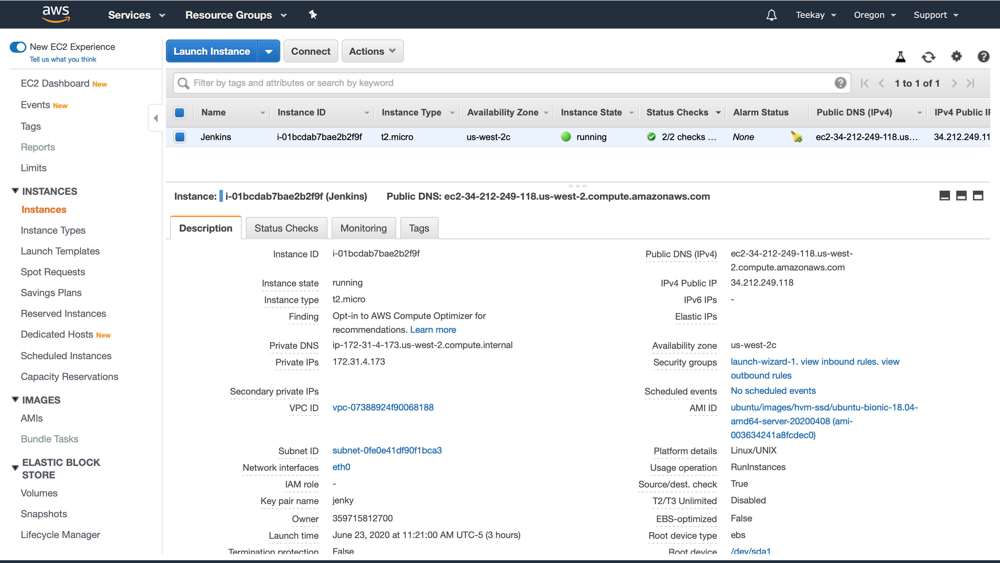
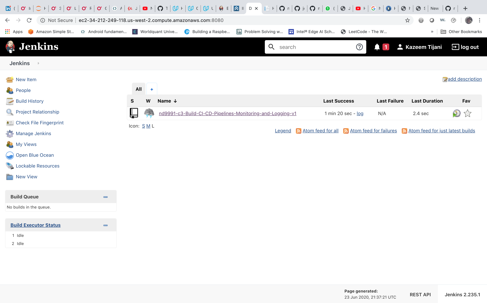
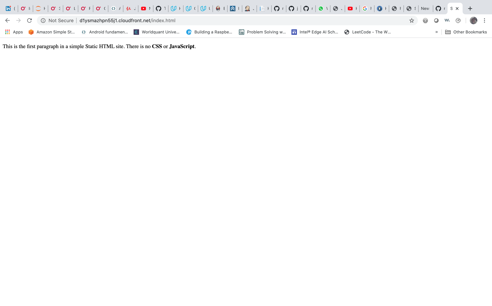
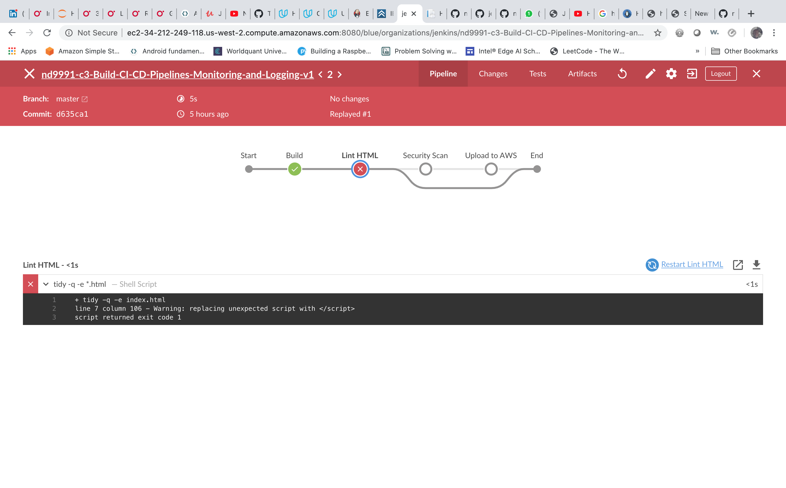
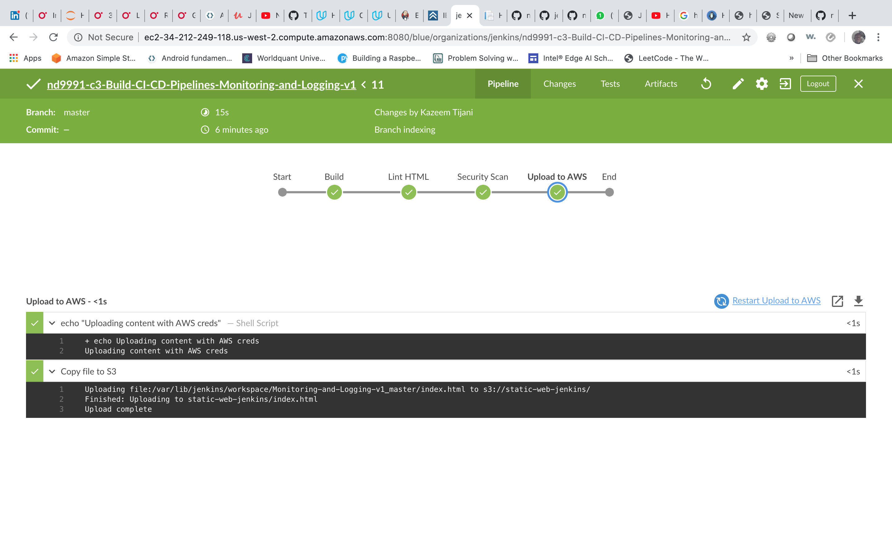

## ND9991 - DEPLOYING JENKINS PIPELINES ON AWS
This repository provides the supporting material for the "ND9991 Cloud DevOps Nanodegree - C3 - Build CI/CD Pipelines, Monitoring, and Logging" project done by Kazeem Tijani. This repo has two more branches, other than the master branch. 

* Blue/Green branch corresponds to the Blue/Green deployment strategy. Make sure that you checkout branches "blue" and "green" to see how blue/green deployment was performed in the course.
* You can create any more branches for a multiple pipeline set-up, as directed in the demonstration video. 

### Dependencies
##### 1. AWS account
You would require to have an AWS account to be able to build cloud infrastructure. Particularly, you will need to create S3 buckets, EC2 instances, and IAM users.

#### 2. Jenkins on Ubuntu VM
As a part of the project, you will need to install Jenkins and a few plugins to assist your requirements, as mentioned in the "Jenkins Pipelines on AWS --> Project Details" page in the classroom. 

## Prerequisite
1. A little knowledge of basic commands in Unix terminal.
1. Understanding of software testing frameworks - JMeter and JUnit
1. Understanding of deployment strategies 

## Outline of this project
Here is the outline of the steps you will take, which match the headers of the sections on the Project Details page:

* AWS Steps
* Install Jenkins On Ubuntu
* Set Up Jenkins
* Install required plugins
* Set up GitHub
* Set up AWS credentials in Jenkins
* Set up S3 Bucket
* Set up pipeline for AWS
* Add another stage in pipeline

Below are the attached results based on project specification.

* Screenshot-01 - Go to IAM dashboard, as the root user. Click on "Users" menu item from the sidebar and select the user that you have just created from the displayed result. Click on the "Permissions" tab. Please provide a screenshot of the AWS console with the permissions being created.

* Screenshot-02 - Launch the EC2 t2.micro for the free tier, pick "Ubuntu 18.04 LTS amd64," review, and when hitting "launch" ensure that an existing pair ("pipeline") from before is selected. If you're not using the right key pair, you cannot log in. Now, an Ubuntu 18.04 t2.micro instance is launched in the AWS EC2, that can be accessed via SSH using the PEM file. A screenshot showing the unique AWS URL of your EC2 instance should be captured.

* Screenshot-03 -Visit Jenkins on its default port, 8080, with your server IP address or domain name included like this: http://your_server_ip_or_domain:8080.

Please provide a screenshot that includes the unique AWS url (ensure the FQDN is used, not the IP)

* Screenshot-04 - Verify everything is working for Blue Ocean by logging in. An "Open Blue Ocean" link should show up in the sidebar. Click it, and it will take you to the "Blue Ocean" screen, where we will have to add a project. Please provide a screenshot that includes the unique AWS url, and shows the sidebar with the Blue Ocean link (ensure the FQDN is used, not the IP)

* Screenshot-05 - Please provide a screenshot that includes the unique AWS url, and shows the GitHub project as a pipeline (ensure the FQDN is used, not the IP)

* Screenshot-06 - Please provide a screenshot that includes the unique AWS url, and shows "index.html" rendered.

* Screenshot-07 - Please provide a screenshot that includes the unique AWS url, and shows the failure when linting.

* Screenshot-08 - Please provide a screenshot that includes the unique AWS url, and shows passing the linting stage and deploys to S3.

My Github Repo can be found in https://github.com/TkConsult/nd9991-c3-Build-CI-CD-Pipelines-Monitoring-and-Logging-v1/

